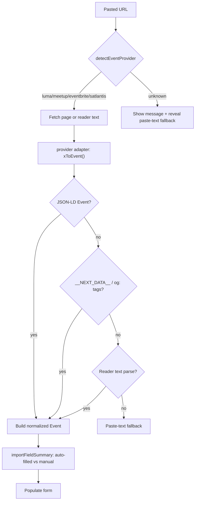
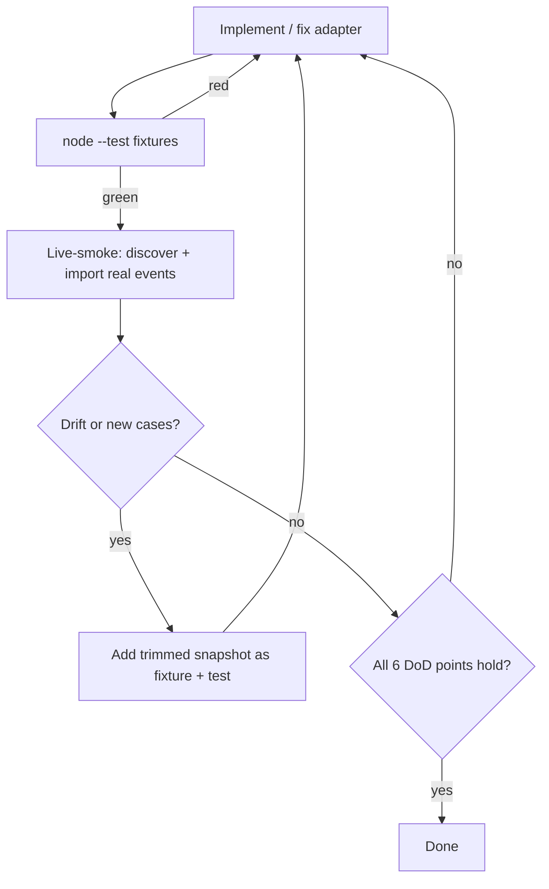

# feat: Multi-platform event import (Eventbrite + Satlantis) + self-verifying harness

## Summary

Add Eventbrite and Satlantis to the existing single-file event poster so a user
can paste **any** of four URLs (Luma, Meetup, Eventbrite, Satlantis), have the
tool auto-detect the source and fill the form, then generate the existing 6-stage
X + Nostr campaign. Ship a self-verifying harness: committed real-event fixtures
drive deterministic unit tests (the RALF "done" gate); a zero-dependency
live-smoke script plus a browser-discovery runbook catch markup drift and harvest
new fixtures.

---

## Problem Frame

The tool reliably imports only Luma and Meetup today. A Bitcoin meetup organizer
runs events across several platforms; anything outside those two falls back to
manual entry, defeating the ~15-minute promise. The two gaps that matter for this
community are Eventbrite (public/ticketed) and Satlantis (Bitcoin-native).

The second problem is verification. Each adapter parses a live site, and live
pages expire, sell out, get edited, and change markup. Hand-checking "does it
still import?" against whatever event is live never settles. The work needs a
stable, reproducible finish line so an autonomous agent can build and *prove* it
without a manual QA loop. See `origin` for full requirements.

---

## Key Technical Decisions

- KTD1. **Adapters extend the existing resolution chain, not a new mechanism.**
  Both new adapters mirror `meetupToEvent`/`lumaToEvent`: JSON-LD →
  `__NEXT_DATA__` deep-find → `og:` meta → reader fallback → paste-text, reusing
  `parseJsonLdEvent`, `deepFindEvent`, `metaContent`, `schemaLocationText`,
  `schemaMapUrl`, `extractSpeaker`, and the `reader*` helpers. Keeps footprint
  small and behavior consistent. (R3, R6)

- KTD2. **Auto-detect replaces the manual provider selector.** The import flow
  routes on `detectEventProvider(url)`; the "Choose Luma / Choose Meetup" buttons
  are removed. An unrecognized or failed URL shows a clear message and reveals the
  existing paste-text/HTML fallback. (R1, R2)

- KTD3. **Satlantis is `og:`-only and partial by design.** Title, date/time, and
  description come from `og:title`/`og:description`; venue, map, and speaker stay
  empty because they are JS-rendered and unreachable without a backend. A pure
  `importFieldSummary(ev, provider)` helper drives the visible
  auto-filled-vs-manual cue. (R7, R8)

- KTD4. **Committed fixtures + a required-field contract are the deterministic
  done-gate.** Real event pages are saved (trimmed to their parsed regions) under
  `test/fixtures/`, loaded by the existing `node --test` suite, and asserted
  against a per-platform contract. Green fixtures = done; no network in the gate.
  (R10, R11)

- KTD5. **The repo stays zero-dependency.** The committed live-smoke is a Node
  `fetch` script (Node 18+; repo runs v25 — server-side fetch has no CORS limit,
  with `r.jina.ai` reader as fallback). Browser-based event *discovery* (searching
  each platform for Denver Bitcoin events) is delegated to the executing agent's
  Playwright MCP tools via a runbook — **not** added as a `package.json` /
  Playwright dependency. Preserves the no-build, no-dependency ethos. (R12)

- KTD6. **Relax the `index.html` byte cap; keep single-file + no-build as the real
  invariant.** The 65KB cap in `BUILD_SPEC.md` was arbitrary; a ~120KB single
  file still loads instantly. The valuable property is one file, paste-and-use, no
  backend — not the exact byte count. Two adapters need headroom. (see System-Wide
  Impact)

---

## High-Level Technical Design

Import resolution — one path for all four providers, degrading gracefully:

The RALF build/verify loop — deterministic gate decides "done", live run feeds it:

---

## Requirements

Carried from `origin`; grouped by concern. These are the reviewer's checklist.

### Import & detection
- R1. Pasting a supported URL auto-detects the provider and runs the matching
  adapter — no manual provider selection.
- R2. Unrecognized/unreachable URL → clear, non-silent message + paste-text
  fallback.
- R3. Robustness chain preserved per adapter (structured-data → reader →
  paste-text); import is deterministic given the same input.
- R4. Import doesn't clobber user-typed fields without the existing
  regenerate-style heads-up; partial/failed imports leave the form usable.

### Platform adapters
- R5. Luma and Meetup keep working, protected by fixtures against regression.
- R6. Eventbrite adapter extracts title, `date_iso` + `tz`, `date_display`,
  location/address, `map_url` (when geo present), description, RSVP URL — with
  reader and paste-text fallback.
- R7. Satlantis adapter extracts title, date/time, description from `og:` tags;
  venue/map/speaker not auto-filled.
- R8. Partial-import cue names which fields were auto-filled and which need manual
  entry (required for Satlantis).
- R9. Imported data feeds the existing post engine unchanged (tones, styles, 6
  stages, `Map:` line, speaker handle/npub, hashtags) — no post-engine work.

### Verification harness
- R10. ≥3 committed real-event fixtures per platform (12+ total), varying
  with/without venue, with/without geo, with/without speaker, ≥1 non-Mountain
  timezone.
- R11. Adapter unit tests run each fixture through its adapter and assert the
  required-field contract, integrated so `node --test 'test/*.test.mjs'` is the
  single green gate.
- R12. Zero-dependency live-smoke: import current Denver-area Bitcoin events per
  platform, emit a field-by-field report, save candidate fixtures. Non-gating,
  tolerant of zero results.
- R13. The Definition-of-Done predicate is committed so an autonomous agent has an
  unambiguous finish line.

---

## Implementation Units

### U1. Provider detection + URL normalization for Eventbrite & Satlantis
- **Goal:** Recognize and canonicalize Eventbrite and Satlantis URLs alongside
  Luma/Meetup.
- **Requirements:** R1, R3
- **Dependencies:** none
- **Files:** `index.html` (engine block: `detectEventProvider`, new
  `normalizeEventbriteUrl`, `normalizeSatlantisUrl`, wire `normalizeEventUrl`),
  `test/load-engine.mjs` (add new names to `EXPORTS`), `test/engine.test.mjs`
- **Approach:** Extend `detectEventProvider` to match `eventbrite.com` and
  country TLDs (`eventbrite.co.uk`, `.ca`, etc.) and `satlantis.io/events/`. Add
  normalizers that ensure scheme, canonical host, and strip tracking params
  (`aff`, `utm_*`). Route both through `normalizeEventUrl`'s provider switch.
- **Patterns to follow:** existing `normalizeMeetupUrl`, `normalizeLumaUrl`,
  `detectEventProvider` in `index.html`.
- **Execution note:** test-first.
- **Test scenarios:**
  - `detectEventProvider` returns `eventbrite` / `satlantis` for representative
    URLs, and `''` for empty/unknown. Covers AE4.
  - Eventbrite ccTLD (`eventbrite.co.uk/e/...`) detected.
  - `normalizeEventbriteUrl` strips `aff=`/`utm_*` and adds scheme.
  - `normalizeSatlantisUrl` preserves `satlantis.io/events/{id}/{slug}`, adds
    scheme.

### U2. Fixture infrastructure + seed real-event fixtures
- **Goal:** A committed, trimmed real-event fixture set and a required-field
  contract the suite asserts against.
- **Requirements:** R5, R10
- **Dependencies:** U1
- **Files:** `test/fixtures/eventbrite/*.html`, `test/fixtures/satlantis/*.html`,
  `test/fixtures/luma/*.html`, `test/fixtures/meetup/*.html`,
  `test/fixtures/load-fixture.mjs`, `test/engine.test.mjs` (contract helper)
- **Approach:** One directory per platform. Each fixture is a real event page
  trimmed to the parsed regions (JSON-LD / `__NEXT_DATA__` / `og:` head) to keep
  size sane while staying real. A small loader reads fixtures by platform. Add a
  reusable `assertRequiredFields(ev, contract)` helper encoding the full contract
  (Luma/Meetup/Eventbrite) and the partial contract (Satlantis). Seed ≥3 for
  Eventbrite and Satlantis and ≥1 each for Luma/Meetup (regression parity). The
  builder fetches real pages to create seeds; the live-smoke (U6) expands them
  later and independently.
- **Patterns to follow:** existing inline `MEETUP_HTML`/`JSONLD_HTML` constants in
  `test/engine.test.mjs` — same assertion style, moved to files for full pages.
- **Test scenarios:**
  - Loader returns the expected fixture count per platform.
  - `Test expectation:` contract helper itself is exercised by U3/U4 tests; add
    one self-test that a known-good event passes and a missing-title event fails.

### U3. Eventbrite adapter (`eventbriteToEvent`)
- **Goal:** Full-field Eventbrite import.
- **Requirements:** R6, R9
- **Dependencies:** U1, U2
- **Files:** `index.html` (engine: `eventbriteToEvent`), `test/load-engine.mjs`
  (`EXPORTS`), `test/engine.test.mjs`
- **Approach:** Mirror `meetupToEvent`. Resolve via `parseJsonLdEvent` →
  `metaContent` `og:` → reader fallback. Use `schemaLocationText` /
  `schemaMapUrl` for venue + geo, timezone from the JSON-LD `startDate` offset
  (and IANA when the page exposes it). Set the RSVP URL (`luma_url` field) to the
  normalized Eventbrite URL. Derive speaker from organizer/description via
  `extractSpeaker`.
- **Patterns to follow:** `meetupToEvent`, `schemaMapUrl`, `formatEventTime`.
- **Execution note:** test-first against U2 fixtures.
- **Test scenarios:**
  - Full extraction from a venue+geo fixture: title, `date_iso`+`tz`,
    `date_display`, location, `map_url`, description, RSVP URL all non-empty; no
    page chrome leaks. Covers AE1.
  - Non-Mountain timezone fixture renders correct local+ET+PT conversions,
    deduped, DST-correct. Covers AE2.
  - Missing-venue fixture still imports (title/date/description) without throwing.
  - Throws a clear error when no title is found (parity with `lumaToEvent`).

### U4. Satlantis adapter (`satlantisToEvent`) — partial
- **Goal:** Best-effort partial import from Satlantis `og:` tags.
- **Requirements:** R7, R8, R9
- **Dependencies:** U1, U2
- **Files:** `index.html` (engine: `satlantisToEvent`), `test/load-engine.mjs`
  (`EXPORTS`), `test/engine.test.mjs`
- **Approach:** Read `og:title` and split the event title from a trailing
  `{Month} {Day} {Year}, {Time}` date fragment; read `og:description` for the
  description. Leave location, `map_url`, speaker empty by design. Best-effort
  parse the date into `date_display` (and `date_iso` when derivable; otherwise
  keep the display string). Return the event so the UI can detect the partial
  shape.
- **Patterns to follow:** `metaContent`, `readerDate`, `stripSourceTitle`.
- **Execution note:** test-first.
- **Test scenarios:**
  - Partial import: title/date/description present; location/`map_url`/speaker
    empty. Covers AE3.
  - Title-vs-date split is correct for the `og:title` shape.
  - Description sourced from `og:description`.

### U5. Auto-detect import flow + partial-import cue
- **Goal:** One paste-and-go import field that routes by detected provider and
  reports what still needs manual entry.
- **Requirements:** R1, R2, R4, R8
- **Dependencies:** U3, U4
- **Files:** `index.html` (UI markup: remove the Choose-Luma/Meetup selector,
  single URL field; import handler dispatch; unknown→message + paste-text reveal;
  render field summary), `index.html` (engine: pure
  `importFieldSummary(ev, provider)`), `test/load-engine.mjs` (`EXPORTS`),
  `test/engine.test.mjs`
- **Approach:** The import handler calls `detectEventProvider(url)`, routes to the
  matching `*ToEvent`, populates the form, and renders `importFieldSummary`
  (auto-filled vs to-add). Unknown/failed → message + reveal the existing
  paste-text fallback. Preserve the existing overwrite heads-up on regenerate.
- **Patterns to follow:** existing import handler + paste-text fallback wiring in
  `index.html`.
- **Test scenarios:**
  - `importFieldSummary` lists venue + map as manual for a Satlantis-shaped event;
    lists all-filled for a full event. Covers AE3.
  - Unknown provider yields the empty/`null` signal the UI uses for AE4's message.
  - `Test expectation:` DOM behaviors (selector removed, fallback reveal) verified
    by manual QA per Acceptance Examples and the live-smoke run.

### U6. Live-smoke harness + discovery runbook
- **Goal:** A zero-dep script that imports real event URLs and reports field
  results, plus a runbook for browser-based discovery.
- **Requirements:** R12
- **Dependencies:** U2, U3, U4
- **Files:** `test/live-smoke.mjs`, `test/fixtures/_candidates/` (output),
  `docs/event-import-live-smoke.md` (runbook)
- **Approach:** Accept event URLs (CLI args or a JSON list). For each: fetch via
  Node `fetch`, falling back to the `r.jina.ai` reader on block/empty; run through
  the engine adapter for the detected provider; print per-field
  PASS/MISSING/MISMATCH against the required-field contract; save a trimmed
  snapshot to `_candidates/` as a fixture candidate. Non-gating; tolerant of
  per-URL failure and zero results for a platform. The runbook documents how an
  agent uses Playwright MCP to search each platform for Denver-area Bitcoin events
  and feed URLs into the script.
- **Patterns to follow:** `test/load-engine.mjs` for engine access; existing
  `buildProxyAttempts`/reader logic for fetch fallback.
- **Test scenarios:**
  - `Test expectation: none` — operational script. Optionally a unit on the
    report formatter if it is extracted as a pure function.

### U7. Definition-of-Done predicate + spec/doc updates
- **Goal:** Commit the finish line and reconcile the docs.
- **Requirements:** R13
- **Dependencies:** U1–U6
- **Files:** `docs/event-import-done.md` (the RALF predicate as a checklist),
  `BUILD_SPEC.md` (relax size cap per KTD6; reconcile §1/§11), `README.md` (four
  platforms; how to run tests + live-smoke), `HANDOFF.md` (basement bootstrap)
- **Approach:** Write the 6-point predicate (see Success Criteria) as a checkable
  list the loop reads. Update the size cap and platform list. Keep neutrality
  language intact.
- **Test scenarios:**
  - `Test expectation: none` — documentation. Verify the neutrality grep still
    returns no matches after README/spec edits.

---

## Acceptance Examples

Carried from `origin`; these are the field contract the fixtures and live-smoke
enforce.

- AE1. Full-data platform fixture (venue + geo) → title, `date_iso`+`tz`,
  `date_display`, location, `map_url`, description, RSVP URL all non-empty; no
  chrome leaks. **Covers R5, R6** (U3).
- AE2. Eventbrite non-Mountain fixture → Live-stage shows local+ET+PT, deduped,
  DST-correct. **Covers R6** (U3).
- AE3. Satlantis fixture → title/date/description filled; venue/map/speaker empty;
  cue names venue + map as manual. **Covers R7, R8** (U4, U5).
- AE4. Unknown/unreachable URL → clear message + paste-text fallback; form stays
  usable. **Covers R2** (U1, U5).
- AE5. Existing Luma/Meetup fixtures still pass after new adapters land.
  **Covers R5** (U2).

---

## Scope Boundaries

### Deferred for later
- Live-smoke as a scheduled/CI job — v1 is on-demand.
- Auto-resolving Satlantis venue/geo via headless render — needs a backend.
- Additional platforms (Splash, Partiful).

### Outside this product's identity
- A separate Nostr-native / NIP-52 / `naddr` tool — Satlantis isn't on Nostr for
  events; one paste-a-URL tool, not two.
- Any backend, build step, API key, or framework dependency in the shipped tool.

### Deferred to follow-up work
- A dedicated size-trim pass on `index.html` if it approaches the relaxed cap
  after all adapters land.

---

## Risks & Dependencies

- **Live sites bot-block direct Node fetch.** Mitigation: `r.jina.ai` reader
  fallback in live-smoke; the gate is fixtures, so this never blocks "done".
- **Satlantis `og:title` date format varies / changes.** Best-effort parse,
  partial-by-design, fixtures pin known shapes, drift detector catches changes.
- **Eventbrite JSON-LD shape assumption.** First Eventbrite fixture verifies it;
  reader + paste-text fallback is the floor if JSON-LD is absent/blocked.
- **Size budget** even after relaxation — keep adapters lean by reusing helpers;
  U7 reconciles the spec.
- **Neutrality constraint** — imported Eventbrite/Satlantis text must pass through
  `sanitizeVenueText`; the neutrality grep must still return no matches.
- **Dependencies/assumptions:** Node 18+ for `fetch` (repo on v25); CORS proxies /
  `r.jina.ai` remain available; Eventbrite exposes JSON-LD `Event`; Satlantis
  keeps `og:title`/`og:description` server-rendered (verified in `origin`
  research); Playwright MCP available on the executing machine for discovery.

---

## System-Wide Impact

- **UX change:** the manual provider selector is removed; the single import field
  becomes the only entry path. Update `BUILD_SPEC.md` §5 form-field description.
- **Size cap policy change (KTD6):** `BUILD_SPEC.md` §1/§11 byte limits relax to a
  ~120KB single-file target; single-file + no-build remain hard invariants.
- **Test surface grows:** `test/fixtures/` and `test/live-smoke.mjs` are new; the
  `EXPORTS` list in `test/load-engine.mjs` gains the new adapter/helper names.

---

## Sources / Research

- `origin`: `docs/brainstorms/2026-06-04-multi-platform-event-import-requirements.md`
  — full requirements, Satlantis architecture findings, DoD predicate.
- Adapter pattern + helpers: `index.html` engine block (`lumaToEvent`,
  `meetupToEvent`, `parseJsonLdEvent`, `deepFindEvent`, `metaContent`,
  `schemaLocationText`, `schemaMapUrl`, `extractSpeaker`, `reader*`,
  `detectEventProvider`, `normalize*Url`).
- Test harness: `test/load-engine.mjs` (ENGINE-START/END extraction + `EXPORTS`),
  `test/engine.test.mjs` (assertion style, inline fixture constants).
- Prior design context: `docs/superpowers/specs/2026-05-23-event-poster-v2-design.md`,
  `docs/superpowers/plans/2026-05-23-event-poster-v2.md`.
